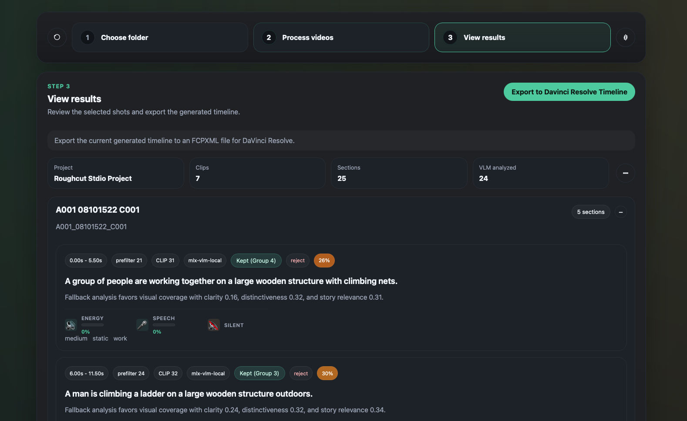

# Roughcut Stdio

A local-first AI-assisted footage screening and rough-cut tool for video editors.

## What This Does

There is too much footage to watch manually. **Roughcut Stdio** solves this by:

- **Scanning** a large set of videos to find candidate moments
- **Refining** those moments into more context-complete candidate segments
- **Transcribing** spoken footage locally when transcript support is available, with selective targeting and probe-based promotion so weak clips do not all pay full transcript cost
- **Surfacing** the strongest segments using deterministic scoring plus optional local AI analysis
- **Grading** each segment on visual, audio, and editorial qualities
- **Assembling** those selections into a first-pass rough timeline

The goal is to help editors skip raw footage scrubbing and move directly from media ingestion to usable shot selection.

📖 **Read the full vision:** [docs/manifesto.md](docs/manifesto.md)



## Quick Start

**macOS setup:**

```bash
git clone https://github.com/your-org/roughcut-stdio
cd roughcut-stdio
npm run setup
npm run view
```

`npm run setup` now installs local transcript support by default because `TIMELINE_TRANSCRIPT_PROVIDER=auto` unless you explicitly disable it.

**Then in the desktop app:**

1. Choose a media folder
2. Click "Process" (the analyzer screens the footage)
3. Review shortlisted shots, grades, and segment provenance
4. Click "Export" to save a DaVinci Resolve timeline

📖 **Full setup guide:** [docs/setup.md](docs/setup.md)

## How It Works

The analyzer runs in four phases:

1. **Media Discovery** — Find all video files and match sources to proxies
2. **Per-Asset Analysis** — Extract signals, build seed regions, refine boundaries, assemble narrative units, and run optional AI analysis
3. **Take Selection** — Score all candidates and pick the best segments per asset
4. **Timeline Assembly** — Order selected takes into a rough cut

📖 **Detailed walkthrough:** [docs/analyzer-pipeline.md](docs/analyzer-pipeline.md)

## Documentation

- 📖 [docs/setup.md](docs/setup.md) — Installation & requirements
- 📖 [docs/configuration.md](docs/configuration.md) — Environment variables & AI provider setup
- 📖 [docs/commands.md](docs/commands.md) — npm commands & debugging
- 📖 [docs/analyzer-pipeline.md](docs/analyzer-pipeline.md) — How the analysis pipeline works
- 📖 [docs/architecture.md](docs/architecture.md) — System design & specs
- 📖 [docs/manifesto.md](docs/manifesto.md) — Project vision & principles
- 🔍 [docs/research.md](docs/research.md) — Research notes & design decisions
- ⚙️ [.env.example](.env.example) — Baseline environment settings

## Architecture

The project is split into three layers:

**Frontend** — `apps/desktop/`

- Native macOS Tauri desktop app with media selection, progress display, and export dialog
- Review surface for recommended segments, timeline state, and segment provenance

**Backend** — `services/analyzer/` (Python)

- Media discovery, signal extraction, deterministic boundary refinement, narrative-unit assembly, optional semantic boundary validation, scoring, CLIP deduplication, VLM analysis, FCPXML export

**Scripts** — `scripts/`

- Shell entrypoints for setup, processing, and export

See [docs/architecture.md](docs/architecture.md) for detailed design decisions and extensibility points.

## Core Features

- **Context-complete segmentation** — Seed regions are deterministically refined, optionally merged or split into better narrative units, and can be semantically validated when boundaries are ambiguous
- **Transcript-backed speech analysis** — Local transcript extraction can feed speech-aware refinement, scoring, and review; the analyzer now uses transcript cache reuse plus selective probing so only strong or validated speech assets pay the full transcription cost, and when transcripts are unavailable speech-heavy clips still degrade through explicit fallback instead of silent visual scoring
- **Review provenance** — Desktop review shows how a segment was formed: boundary strategy, confidence, lineage, and semantic-validation status
- **CLIP-based deduplication** — Semantic near-duplicate detection using embeddings (cosine similarity >= 0.95)
- **Audio & visual analysis** — Frame signals (sharpness, motion, distinctiveness) + audio signals (RMS, silence)
- **Three-stage VLM filtering** — Dedup filter → CLIP gate → per-asset limit for efficient compute
- **Caching & reuse** — CLIP embeddings cached during scoring, reused by dedup (zero redundant computation)
- **Histogram fallback** — Deduplication works without CLIP (configurable threshold)
- **Local-first** — All processing stays on your machine; no cloud dependencies
- **DaVinci Resolve export** — FCPXML timelines ready to import and continue editing

## AI Provider Options

| Provider          | Setup          | Speed    | Quality | Best For                                 |
| ----------------- | -------------- | -------- | ------- | ---------------------------------------- |
| **Deterministic** | None           | Fast     | Basic   | Testing, prototyping                     |
| **MLX-VLM Local** | Auto-installed | Moderate | High    | Local workflows, Apple Silicon Macs      |
| **LM Studio**     | Download app   | Varies   | High    | Trying different models, non-MLX systems |

See [docs/configuration.md](docs/configuration.md) for setup details and examples.

## Development

```bash
npm run dev:desktop    # Launch app in dev mode
npm run build:desktop  # Build production app
npm run process        # Run analyzer directly
npm run check:openspec-graph  # Validate chained OpenSpec change metadata
npm run test:python    # Run Python tests
```

Full command reference: [docs/commands.md](docs/commands.md)

## Requirements

- Node.js 18+, npm 9+, Python 3.12+
- Xcode Command Line Tools, Rust/Cargo
- ffmpeg (installed automatically by setup script)

See [docs/setup.md](docs/setup.md) for detailed requirements and troubleshooting.

## License

[Your License Here]
